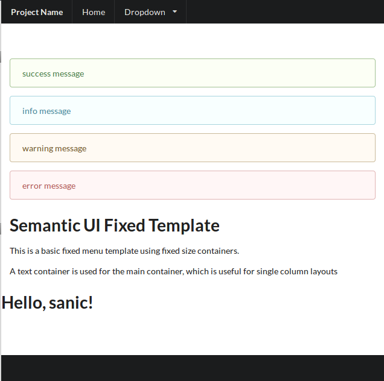

# sanic-jinja2
Jinja2 support for sanic



## Installation

`python3 -m pip install sanic-jinja2`

## Features

`sanic-jinja2` supports:

- Flask-like `flash` method
- i18n and Babel support
- `@jinja.template` syntax
- [session extension](https://github.com/xen/sanic_session) support
- factory pattern `init_app` method for creating apps


## Usage

**NOTICE**:

If you want to use `flash` and `get_flashed_messages`, you need setup session first.

Currently, app and request are hooked into jinja templates, thus you can use them in template directly.

And, from version 0.3.0 enable_async is default to True.
If you need sync functions, use jinja.render_sync, jinja.render_string_sync

Python3.5 does not support new async syntax, so 0.5.0 disable async back, sorry.

BUG: request should not be set to global environment, so you need use request['flash'] instead of jinja.flash and need pass request to render to use get_flashed_messages.

### Examples

```python

#!/usr/bin/env python
# -*- coding: utf-8 -*-

from sanic import Sanic
from sanic_session import Session, InMemorySessionInterface
from sanic_jinja2 import SanicJinja2

app = Sanic()

session = Session(app, interface=InMemorySessionInterface())
jinja = SanicJinja2(app, session=session)
#
# Specify the package name, if templates/ dir is inside module
# jinja = SanicJinja2(app, pkg_name='sanicapp')
# or use customized templates path
# jinja = SanicJinja2(app, pkg_name='sanicapp', pkg_path='other/templates')
# or setup later
# jinja = SanicJinja2()
# jinja.init_app(app)

@app.route('/')
@jinja.template('index.html')  # decorator method is staticmethod
async def index(request):
    jinja.flash(request, 'success message', 'success')
    jinja.flash(request, 'info message', 'info')
    jinja.flash(request, 'warning message', 'warning')
    jinja.flash(request, 'error message', 'error')
    jinja.session(request)["session key"] = "session value"
    return {'greetings': 'Hello, sanic!'}


if __name__ == '__main__':
    app.run(host='0.0.0.0', port=8000, debug=True)
```
